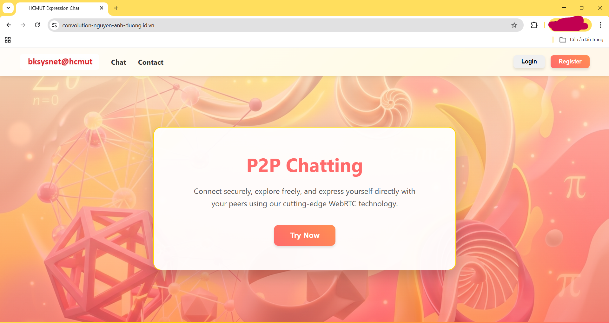

# WebRTC P2P Chat - WeApRous Framework

This project is an advanced, WebRTC-integrated evolution of my previous coursework assignment: [https://github.com/Duong-John/K251_MMT]. 

While the original project focused on a basic client-server architecture using raw Python sockets, this upgraded version transforms the system into a true **Peer-to-Peer (P2P) communication platform**, supporting real-time text and voice chat across different networks.

> **Purpose**: This project does not aim for a real-life product like Facebook or Zalo; instead, it is solely aimed at gaining insights into some technical and academic problems when building a server from scratch without using state-of-the-art technologies like Node.js or React.js.
## Key Features
* **Custom HTTP Server & Reverse Proxy:** Built entirely from scratch using Python raw `socket` and `threading`, featuring custom routing, HTTP parsing, and Rate Limiting.
* **WebRTC P2P Integration:** Utilizes `RTCPeerConnection`, `RTCDataChannel`, and `MediaStreamTrack` for direct browser-to-browser text and audio streaming.
* **HTTP Polling Signaling:** A custom signaling server mechanism to exchange Session Description Protocol (SDP) Offers/Answers and ICE Candidates.
* **NAT Traversal:** Integrated with external STUN and TURN servers to bypass firewalls and enable cross-network (Internet) connectivity.
* **Modern UI/UX:** Responsive landing page and chat interface with real-time incoming call notifications and connection state handling.
* **Domain Supported:** The project is launched and tested on the domain [http://convolution-nguyen-anh-duong.id.vn/]. Note that this is my personal domain whose proxy is already supported by CloudFlare, so ```proxy.py``` is a relic from the original project when testing in LAN.
> **Note**: the domain is not 24/7 due to dependency on the tunnel linked to my device, and I sometimes run the server. Contact me for more information.

## Acknowledgements & License

This project is built upon the **WeApRous** framework, originally developed for the Computer Networks course at Ho Chi Minh City University of Technology (HCMUT). 

I would like to express my sincere gratitude to the original author for providing the foundational framework:

> **Copyright (C) 2025 pdnguyen of HCMC University of Technology VNU-HCM.** > **All rights reserved.** > 
> This project is part of the **CO3093/CO3094 course**, and is released under the **MIT License Agreement**.  
> **WeApRous release.** > 
> *The authors hereby grant to Licensee personal permission to use and modify the Licensed Source Code for the sole purpose of studying while attending the course.*

---
*Developed & Upgraded by [Nguyễn Ánh Dương] - 2026*

## How to run
1. In ```start_sampleapp.py```, you can find the decorator which defines the action ```/get_ice_config``` at line 158. Currently, it only includes a single public Credential Key of Google (placeholder). For the system to work properly, add your TURN and STUN Credential Key, which can be registered at [https://www.metered.ca/] for example.
2. Manage the ```/config/proxy.conf``` to change the host or assign a new backend server to your backend pool. The configuration format is similar to that of NGINX: [https://nginx.org/]
3. Type in the terminal: ```python start_proxy.py``` to run the proxy on port 9000 (make sure that no app on your device is using this port)
4. Depending on the number of servers in ```/config/proxy.conf```, you will start the same number of servers. For example, if 2 servers are included and their port are 8000 and 8001, type in ```python start_proxy.py -server-port 8000``` and ```python start_proxy.py -server-port 8001``` respectively.

> **Note**: There will be an update for this project

## Demo Video
[](https://www.youtube.com/watch?v=ADR8qkTgHEc)
